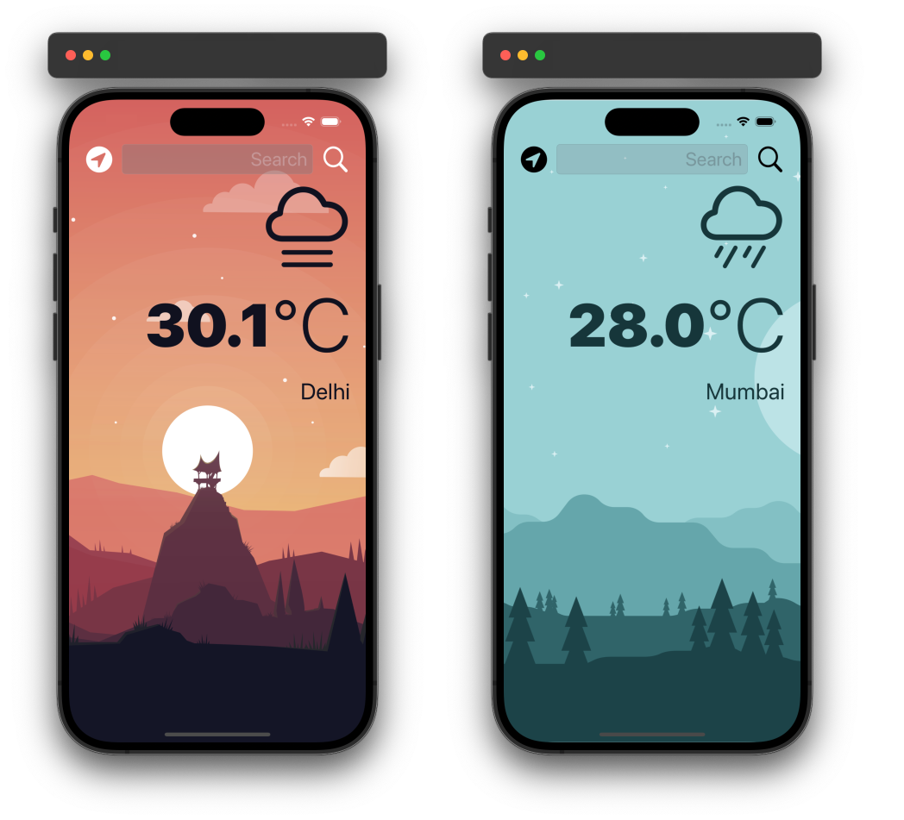

# Clima

## Introduction

Clima is an iOS application designed to fetch and display current weather data for a specified city or coordinates. It utilizes the OpenWeatherMap API to retrieve weather data and displays it to the user in a user-friendly format.

### Preview

<div style="text-align: center;">
  
</div>

## Features

### Core Features

1. **Fetching Weather by City Name**:
    - The app allows users to fetch weather data by specifying a city name. The `fetchWeather(cityName:)` method constructs a URL with the city name and sends a request to the OpenWeatherMap API.

2. **Fetching Weather by Geographic Coordinates**:
    - Users can also fetch weather data by providing geographic coordinates (latitude and longitude). The `fetchWeather(lat:lon:)` method constructs a URL with the provided coordinates and sends a request to the API.

3. **Parsing JSON Data**:
    - The app uses `JSONDecoder` to parse the JSON response from the OpenWeatherMap API. The `WeatherData` struct conforms to the `Decodable` protocol and maps the JSON structure to Swift objects.

4. **Displaying Weather Information**:
    - Weather data, including city name, temperature, and weather conditions, is encapsulated in the `WeatherModel` struct. The app displays this information using computed properties to provide a user-friendly format.

### Error Handling

- The app implements error handling through the `WeatherManagerDelegate` protocol. If an error occurs during the API request or JSON parsing, the delegate's `didFailWithError` method is called, allowing the app to handle and display error messages appropriately.

### Protocol-Oriented Programming

- The `WeatherManagerDelegate` protocol is used to define methods for updating weather data and handling errors. This approach promotes code modularity and reusability.


## Code Structure

### WeatherManager

The `WeatherManager` struct is responsible for managing API requests and data parsing.

```swift
struct WeatherManager {
    let apiKey = ""
    let weatherURL = "https://api.openweathermap.org/data/2.5/weather?units=metric"
    
    var delegate: WeatherManagerDelegate?
    
    func fetchWeather(cityName: String) {
        let customURL = "\(weatherURL)&appid=\(apiKey)&q=\(cityName)"
        performRequest(with: customURL)
    }
    
    func fetchWeather(lat: CLLocationDegrees, lon: CLLocationDegrees) {
        let customURL = "\(weatherURL)&appid=\(apiKey)&lat=\(lat)&lon=\(lon)"
        performRequest(with: customURL)
    }
    
    func performRequest(with customURL: String) {
        if let url = URL(string: customURL) {
            let session = URLSession(configuration: .default)
            let task = session.dataTask(with: url) { data, response, error in
                if error != nil {
                    delegate?.didFailWithError(self, error: error!)
                } else {
                    if let safeData = data {
                        if let weather = self.parseJSON(weatherData: safeData) {
                            delegate?.didUpdateWeather(self, weather: weather)
                        }
                    }
                }
            }
            task.resume()
        }
    }
    
    func parseJSON(weatherData: Data) -> WeatherModel? {
        let decoder = JSONDecoder()
        do {
            let decodedData = try decoder.decode(WeatherData.self, from: weatherData)
            let cityName = decodedData.name
            let cityTemp = decodedData.main.temp
            let cityConditionID = decodedData.weather[0].id
            
            let weather = WeatherModel(cityName: cityName, cityTemp: cityTemp, cityConditionID: cityConditionID)
            return weather
            
        } catch {
            delegate?.didFailWithError(self, error: error)
            return nil
        }
    }
}
```

### WeatherModel

The `WeatherModel` struct encapsulates weather data and provides computed properties for a user-friendly display.

```swift
struct WeatherModel {
    let cityName: String
    let cityTemp: Double
    let cityConditionID: Int
    
    var conditionName: String {
        return getConditionName(cityConditionID: cityConditionID)
    }
    
    var temperatureString: String {
        return String(format: "%.1f", cityTemp)
    }
    
    func getConditionName(cityConditionID: Int) -> String {
        switch cityConditionID {
            case 200...232:
                return "cloud.bolt"
            case 300...321:
                return "cloud.drizzle"
            case 500...531:
                return "cloud.rain"
            case 600...622:
                return "cloud.snow"
            case 701...781:
                return "cloud.fog"
            case 800:
                return "sun.max"
            case 801...804:
                return "cloud.bolt"
            default:
                return "cloud"
        }
    }
}
```

### WeatherData

The `WeatherData` struct maps the JSON structure from the OpenWeatherMap API response to Swift objects.

```swift
struct WeatherData: Decodable {
    let weather: [Weather]
    let main: Main
    let name: String
}

struct Weather: Decodable {
    let id: Int
    let main: String
    let description: String
    let icon: String
}

struct Main: Decodable {
    let temp: Double
    let feels_like: Float
    let temp_min: Float
    let temp_max: Float
    let pressure: Int
    let humidity: Int
}
```

## Conclusion

Clima is a robust and user-friendly iOS application that leverages the OpenWeatherMap API to provide real-time weather data. By following protocol-oriented programming and utilizing modern Swift features, Clima ensures a smooth and efficient user experience.